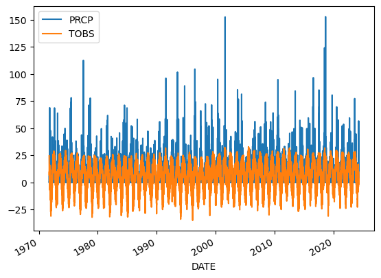
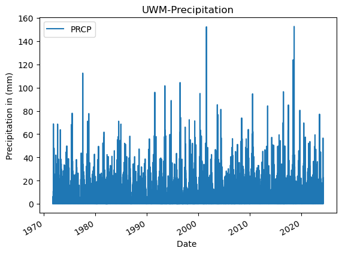
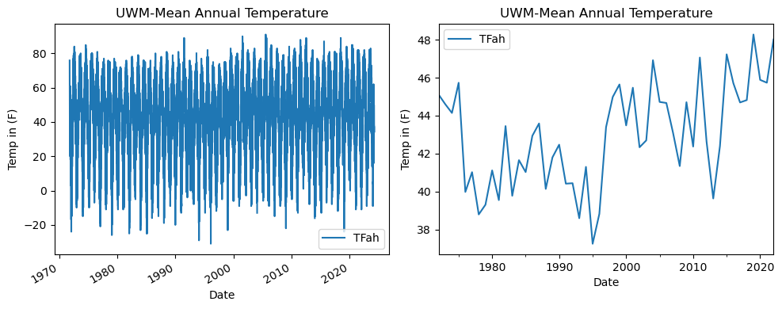

# Second Assigment - Get started with open reproducible science! (API version Challenge)

------------------------------------------------------------------------

1. **What is Open Reproducible Science?** - In my understanding, open reproducible science refers to the practice of conducting scientific research in a way that others can easily access, replicate, and validate the findings. This approach promotes transparency and accountability in research by making methodologies, data, and results freely available.

2. **Git and GitHub** support open reproducible science by providing tools for version control and collaboration, allowing researchers to share their code, track changes, and manage contributions transparently. This infrastructure enables the scientific community to review, replicate, and build upon work, thus fostering a collaborative and open scientific environment.


> **Machine Readable Name** - Yes, the Jupyter Notebook file "Get Started with Open Reproducible Science!.ipynb" has a machine-readable name. The format ".ipynb" indicates it is a Jupyter Notebook, and the rest of the filename, though human-friendly with spaces and punctuation, is still readable by machines which can interpret it as a string for file operations and display purposes.

## **Readable, well-documented scientific workflows are easier to reproduce**

I can write clean code by:
1. **Using meaningful and descriptive names for variables, functions, and classes** to make the code easier to understand and maintain.
2. **Keeping functions short and focused on a single task**, which enhances readability and simplifies debugging.
3. **Consistently using comments and documentation** to explain the purpose and functionality of the code, aiding future maintainers and contributors.

Advantages of clean code include:
1. **Easier maintenance and debugging** as cleaner, simpler code reduces the complexity that can obscure bugs.
2. **Enhanced collaboration** since clean code is easier for other developers to read, understand, and contribute to.
3. **Increased efficiency in development cycles**, with developers spending less time deciphering the existing codebase, allowing for quicker enhancements and fixes.

------------------------------------------------------------------------

## **Getting started with the Assignment**

The Global Historical Climatology Network - Daily (GHCNd) is maintained by the National Climatic Data Center (NCDC), part of the National Oceanic and Atmospheric Administration (NOAA). The dataset includes daily climate records from thousands of land-based stations worldwide, spanning from the mid-1700s to the present. Temperatures in the GHCNd are primarily recorded in degrees Celsius, though historical data may also include records in Fahrenheit. Data are collected using standardized instruments and techniques at meteorological stations globally, ensuring consistency and reliability across measurements.

Citation: Menne, M.J., I. Durre, B. Korzeniewski, S. McNeal, K. Thomas, X. Yin, S. Anthony, R. Ray, R.S. Vose, B.E. Gleason, and T.G. Houston, 2012d: Global Historical Climatology Network - Daily (GHCN-Daily), Version 3. NOAA National Climatic Data Center. [http://doi.org/10.7289/V5D21VHZ](http://doi.org/10.7289/V5D21VHZ).
```
---------------------
**Programming Part Begins**
---------------------
**Renamed as madison_timeseries**
```python
import pandas as pd
```

```python
uwm_url = (
    'https://www.ncei.noaa.gov/access/services/data/v1?'
    'dataset=daily-summaries&dataTypes=TOBS,PRCP&'
    'stations=USC00470273&startDate=1971-10-01&endDate=2024-04-05&'
    'includeStationName=true&includeStation'
    'Location=1&units=metric')
uwm_url
```
    'https://www.ncei.noaa.gov/access/services/data/v1?dataset=daily-summaries&dataTypes=TOBS,PRCP&stations=USC00470273&startDate=1971-10-01&endDate=2024-04-05&includeStationName=true&includeStationLocation=1&units=metric'

```python
madison_df = pd.read_csv(
 uwm_url, index_col='DATE', parse_dates=True, na_values='NaN')
madison_df
```


<div>
<style scoped>
    .dataframe tbody tr th:only-of-type {
        vertical-align: middle;
    }

    .dataframe tbody tr th {
        vertical-align: top;
    }

    .dataframe thead th {
        text-align: right;
    }
</style>
<table border="1" class="dataframe">
  <thead>
    <tr style="text-align: right;">
      <th></th>
      <th>STATION</th>
      <th>NAME</th>
      <th>LATITUDE</th>
      <th>LONGITUDE</th>
      <th>ELEVATION</th>
      <th>PRCP</th>
      <th>TOBS</th>
    </tr>
    <tr>
      <th>DATE</th>
      <th></th>
      <th></th>
      <th></th>
      <th></th>
      <th></th>
      <th></th>
      <th></th>
    </tr>
  </thead>
  <tbody>
    <tr>
      <th>1971-10-01</th>
      <td>USC00470273</td>
      <td>UW ARBORETUM MADISON, WI US</td>
      <td>43.04118</td>
      <td>-89.42872</td>
      <td>265.2</td>
      <td>0.0</td>
      <td>24.4</td>
    </tr>
    <tr>
      <th>1971-10-02</th>
      <td>USC00470273</td>
      <td>UW ARBORETUM MADISON, WI US</td>
      <td>43.04118</td>
      <td>-89.42872</td>
      <td>265.2</td>
      <td>0.0</td>
      <td>19.4</td>
    </tr>
    <tr>
      <th>1971-10-03</th>
      <td>USC00470273</td>
      <td>UW ARBORETUM MADISON, WI US</td>
      <td>43.04118</td>
      <td>-89.42872</td>
      <td>265.2</td>
      <td>3.8</td>
      <td>19.4</td>
    </tr>
    <tr>
      <th>1971-10-04</th>
      <td>USC00470273</td>
      <td>UW ARBORETUM MADISON, WI US</td>
      <td>43.04118</td>
      <td>-89.42872</td>
      <td>265.2</td>
      <td>0.5</td>
      <td>11.1</td>
    </tr>
    <tr>
      <th>1971-10-05</th>
      <td>USC00470273</td>
      <td>UW ARBORETUM MADISON, WI US</td>
      <td>43.04118</td>
      <td>-89.42872</td>
      <td>265.2</td>
      <td>0.3</td>
      <td>15.0</td>
    </tr>
    <tr>
      <th>...</th>
      <td>...</td>
      <td>...</td>
      <td>...</td>
      <td>...</td>
      <td>...</td>
      <td>...</td>
      <td>...</td>
    </tr>
    <tr>
      <th>2024-04-01</th>
      <td>USC00470273</td>
      <td>UW ARBORETUM MADISON, WI US</td>
      <td>43.04118</td>
      <td>-89.42872</td>
      <td>265.2</td>
      <td>0.0</td>
      <td>3.3</td>
    </tr>
    <tr>
      <th>2024-04-02</th>
      <td>USC00470273</td>
      <td>UW ARBORETUM MADISON, WI US</td>
      <td>43.04118</td>
      <td>-89.42872</td>
      <td>265.2</td>
      <td>12.4</td>
      <td>3.3</td>
    </tr>
    <tr>
      <th>2024-04-03</th>
      <td>USC00470273</td>
      <td>UW ARBORETUM MADISON, WI US</td>
      <td>43.04118</td>
      <td>-89.42872</td>
      <td>265.2</td>
      <td>56.6</td>
      <td>1.1</td>
    </tr>
    <tr>
      <th>2024-04-04</th>
      <td>USC00470273</td>
      <td>UW ARBORETUM MADISON, WI US</td>
      <td>43.04118</td>
      <td>-89.42872</td>
      <td>265.2</td>
      <td>1.0</td>
      <td>1.1</td>
    </tr>
    <tr>
      <th>2024-04-05</th>
      <td>USC00470273</td>
      <td>UW ARBORETUM MADISON, WI US</td>
      <td>43.04118</td>
      <td>-89.42872</td>
      <td>265.2</td>
      <td>0.0</td>
      <td>2.8</td>
    </tr>
  </tbody>
</table>
<p>18998 rows × 7 columns</p>
</div>


```python
# Data was imported into a pandas DataFrame
type(madison_df)
```

    pandas.core.frame.DataFrame


```python
madison_df = madison_df[['PRCP', 'TOBS']]
madison_df
```


<div>
<style scoped>
    .dataframe tbody tr th:only-of-type {
        vertical-align: middle;
    }

    .dataframe tbody tr th {
        vertical-align: top;
    }

    .dataframe thead th {
        text-align: right;
    }
</style>
<table border="1" class="dataframe">
  <thead>
    <tr style="text-align: right;">
      <th></th>
      <th>PRCP</th>
      <th>TOBS</th>
    </tr>
    <tr>
      <th>DATE</th>
      <th></th>
      <th></th>
    </tr>
  </thead>
  <tbody>
    <tr>
      <th>1971-10-01</th>
      <td>0.0</td>
      <td>24.4</td>
    </tr>
    <tr>
      <th>1971-10-02</th>
      <td>0.0</td>
      <td>19.4</td>
    </tr>
    <tr>
      <th>1971-10-03</th>
      <td>3.8</td>
      <td>19.4</td>
    </tr>
    <tr>
      <th>1971-10-04</th>
      <td>0.5</td>
      <td>11.1</td>
    </tr>
    <tr>
      <th>1971-10-05</th>
      <td>0.3</td>
      <td>15.0</td>
    </tr>
    <tr>
      <th>...</th>
      <td>...</td>
      <td>...</td>
    </tr>
    <tr>
      <th>2024-04-01</th>
      <td>0.0</td>
      <td>3.3</td>
    </tr>
    <tr>
      <th>2024-04-02</th>
      <td>12.4</td>
      <td>3.3</td>
    </tr>
    <tr>
      <th>2024-04-03</th>
      <td>56.6</td>
      <td>1.1</td>
    </tr>
    <tr>
      <th>2024-04-04</th>
      <td>1.0</td>
      <td>1.1</td>
    </tr>
    <tr>
      <th>2024-04-05</th>
      <td>0.0</td>
      <td>2.8</td>
    </tr>
  </tbody>
</table>
<p>18998 rows × 2 columns</p>
</div>


------------------------------------------------------------------------

## Plotting the precpitation column (PRCP) vs time to explore the data

```python
madison_df.plot()
```


    <Axes: xlabel='DATE'>


    

    


```python
# Plot the data using .plot
madison_df.plot(
    y='PRCP',
    title='UWM-Precipitation',
    xlabel='Date ',
    ylabel='Precipitation in (mm)')
```


    <Axes: title={'center': 'UWM-Precipitation'}, xlabel='Date ', ylabel='Precipitation in (mm)'>


    

    


**Converting to celsius - vectortized operation**


```python
madison_df.loc[:,'TFah'] = (madison_df.loc[:,'TOBS'] * (9 / 5)) + 32
madison_df
```

    /tmp/ipykernel_36403/3593513323.py:1: SettingWithCopyWarning: 
    A value is trying to be set on a copy of a slice from a DataFrame.
    Try using .loc[row_indexer,col_indexer] = value instead
    
    See the caveats in the documentation: https://pandas.pydata.org/pandas-docs/stable/user_guide/indexing.html#returning-a-view-versus-a-copy
      madison_df.loc[:,'TFah'] = (madison_df.loc[:,'TOBS'] * (9 / 5)) + 32


<div>
<style scoped>
    .dataframe tbody tr th:only-of-type {
        vertical-align: middle;
    }

    .dataframe tbody tr th {
        vertical-align: top;
    }

    .dataframe thead th {
        text-align: right;
    }
</style>
<table border="1" class="dataframe">
  <thead>
    <tr style="text-align: right;">
      <th></th>
      <th>PRCP</th>
      <th>TOBS</th>
      <th>TFah</th>
    </tr>
    <tr>
      <th>DATE</th>
      <th></th>
      <th></th>
      <th></th>
    </tr>
  </thead>
  <tbody>
    <tr>
      <th>1971-10-01</th>
      <td>0.0</td>
      <td>24.4</td>
      <td>75.92</td>
    </tr>
    <tr>
      <th>1971-10-02</th>
      <td>0.0</td>
      <td>19.4</td>
      <td>66.92</td>
    </tr>
    <tr>
      <th>1971-10-03</th>
      <td>3.8</td>
      <td>19.4</td>
      <td>66.92</td>
    </tr>
    <tr>
      <th>1971-10-04</th>
      <td>0.5</td>
      <td>11.1</td>
      <td>51.98</td>
    </tr>
    <tr>
      <th>1971-10-05</th>
      <td>0.3</td>
      <td>15.0</td>
      <td>59.00</td>
    </tr>
    <tr>
      <th>...</th>
      <td>...</td>
      <td>...</td>
      <td>...</td>
    </tr>
    <tr>
      <th>2024-04-01</th>
      <td>0.0</td>
      <td>3.3</td>
      <td>37.94</td>
    </tr>
    <tr>
      <th>2024-04-02</th>
      <td>12.4</td>
      <td>3.3</td>
      <td>37.94</td>
    </tr>
    <tr>
      <th>2024-04-03</th>
      <td>56.6</td>
      <td>1.1</td>
      <td>33.98</td>
    </tr>
    <tr>
      <th>2024-04-04</th>
      <td>1.0</td>
      <td>1.1</td>
      <td>33.98</td>
    </tr>
    <tr>
      <th>2024-04-05</th>
      <td>0.0</td>
      <td>2.8</td>
      <td>37.04</td>
    </tr>
  </tbody>
</table>
<p>18998 rows × 3 columns</p>
</div>


**Creating a Function**


```python

def convert_to_celsius(fahrenheit):
    """Convert temperature from Fahrenheit to Celsius."""
    return (fahrenheit - 32) * 5 / 9

# Assume 'dataframe' is your existing DataFrame and it has a column 'fahrenheit_column'
# which contains temperature values in Fahrenheit.
madison_df['celsius_column'] = madison_df['TOBS'].apply(convert_to_celsius)
madison_df
```

    /tmp/ipykernel_36403/1707990930.py:7: SettingWithCopyWarning: 
    A value is trying to be set on a copy of a slice from a DataFrame.
    Try using .loc[row_indexer,col_indexer] = value instead
    
    See the caveats in the documentation: https://pandas.pydata.org/pandas-docs/stable/user_guide/indexing.html#returning-a-view-versus-a-copy
      madison_df['celsius_column'] = madison_df['TOBS'].apply(convert_to_celsius)


<div>
<style scoped>
    .dataframe tbody tr th:only-of-type {
        vertical-align: middle;
    }

    .dataframe tbody tr th {
        vertical-align: top;
    }

    .dataframe thead th {
        text-align: right;
    }
</style>
<table border="1" class="dataframe">
  <thead>
    <tr style="text-align: right;">
      <th></th>
      <th>PRCP</th>
      <th>TOBS</th>
      <th>TFah</th>
      <th>celsius_column</th>
    </tr>
    <tr>
      <th>DATE</th>
      <th></th>
      <th></th>
      <th></th>
      <th></th>
    </tr>
  </thead>
  <tbody>
    <tr>
      <th>1971-10-01</th>
      <td>0.0</td>
      <td>24.4</td>
      <td>75.92</td>
      <td>-4.222222</td>
    </tr>
    <tr>
      <th>1971-10-02</th>
      <td>0.0</td>
      <td>19.4</td>
      <td>66.92</td>
      <td>-7.000000</td>
    </tr>
    <tr>
      <th>1971-10-03</th>
      <td>3.8</td>
      <td>19.4</td>
      <td>66.92</td>
      <td>-7.000000</td>
    </tr>
    <tr>
      <th>1971-10-04</th>
      <td>0.5</td>
      <td>11.1</td>
      <td>51.98</td>
      <td>-11.611111</td>
    </tr>
    <tr>
      <th>1971-10-05</th>
      <td>0.3</td>
      <td>15.0</td>
      <td>59.00</td>
      <td>-9.444444</td>
    </tr>
    <tr>
      <th>...</th>
      <td>...</td>
      <td>...</td>
      <td>...</td>
      <td>...</td>
    </tr>
    <tr>
      <th>2024-04-01</th>
      <td>0.0</td>
      <td>3.3</td>
      <td>37.94</td>
      <td>-15.944444</td>
    </tr>
    <tr>
      <th>2024-04-02</th>
      <td>12.4</td>
      <td>3.3</td>
      <td>37.94</td>
      <td>-15.944444</td>
    </tr>
    <tr>
      <th>2024-04-03</th>
      <td>56.6</td>
      <td>1.1</td>
      <td>33.98</td>
      <td>-17.166667</td>
    </tr>
    <tr>
      <th>2024-04-04</th>
      <td>1.0</td>
      <td>1.1</td>
      <td>33.98</td>
      <td>-17.166667</td>
    </tr>
    <tr>
      <th>2024-04-05</th>
      <td>0.0</td>
      <td>2.8</td>
      <td>37.04</td>
      <td>-16.222222</td>
    </tr>
  </tbody>
</table>
<p>18998 rows × 4 columns</p>
</div>


**Subsetting and Resampling**


```python
# Subsetting the data to look at 1972-2023
madison_1971_2024 = madison_df.loc['1972-10-1':'2023-09']
madison_1971_2024
```


<div>
<style scoped>
    .dataframe tbody tr th:only-of-type {
        vertical-align: middle;
    }

    .dataframe tbody tr th {
        vertical-align: top;
    }

    .dataframe thead th {
        text-align: right;
    }
</style>
<table border="1" class="dataframe">
  <thead>
    <tr style="text-align: right;">
      <th></th>
      <th>PRCP</th>
      <th>TOBS</th>
      <th>TFah</th>
      <th>celsius_column</th>
    </tr>
    <tr>
      <th>DATE</th>
      <th></th>
      <th></th>
      <th></th>
      <th></th>
    </tr>
  </thead>
  <tbody>
    <tr>
      <th>1972-10-01</th>
      <td>0.0</td>
      <td>11.1</td>
      <td>51.98</td>
      <td>-11.611111</td>
    </tr>
    <tr>
      <th>1972-10-02</th>
      <td>0.0</td>
      <td>12.8</td>
      <td>55.04</td>
      <td>-10.666667</td>
    </tr>
    <tr>
      <th>1972-10-03</th>
      <td>0.0</td>
      <td>15.0</td>
      <td>59.00</td>
      <td>-9.444444</td>
    </tr>
    <tr>
      <th>1972-10-04</th>
      <td>0.0</td>
      <td>13.9</td>
      <td>57.02</td>
      <td>-10.055556</td>
    </tr>
    <tr>
      <th>1972-10-05</th>
      <td>0.3</td>
      <td>15.0</td>
      <td>59.00</td>
      <td>-9.444444</td>
    </tr>
    <tr>
      <th>...</th>
      <td>...</td>
      <td>...</td>
      <td>...</td>
      <td>...</td>
    </tr>
    <tr>
      <th>2023-09-26</th>
      <td>41.4</td>
      <td>16.7</td>
      <td>62.06</td>
      <td>-8.500000</td>
    </tr>
    <tr>
      <th>2023-09-27</th>
      <td>16.3</td>
      <td>17.2</td>
      <td>62.96</td>
      <td>-8.222222</td>
    </tr>
    <tr>
      <th>2023-09-28</th>
      <td>5.8</td>
      <td>17.2</td>
      <td>62.96</td>
      <td>-8.222222</td>
    </tr>
    <tr>
      <th>2023-09-29</th>
      <td>0.0</td>
      <td>14.4</td>
      <td>57.92</td>
      <td>-9.777778</td>
    </tr>
    <tr>
      <th>2023-09-30</th>
      <td>0.0</td>
      <td>18.9</td>
      <td>66.02</td>
      <td>-7.277778</td>
    </tr>
  </tbody>
</table>
<p>18457 rows × 4 columns</p>
</div>


**Calculating annual statistics**


```python
# Resampling the data to look at yearly mean values
madison_yearly_mean = madison_1971_2024.resample('YS-OCT').mean()
madison_yearly_mean
```


<div>
<style scoped>
    .dataframe tbody tr th:only-of-type {
        vertical-align: middle;
    }

    .dataframe tbody tr th {
        vertical-align: top;
    }

    .dataframe thead th {
        text-align: right;
    }
</style>
<table border="1" class="dataframe">
  <thead>
    <tr style="text-align: right;">
      <th></th>
      <th>PRCP</th>
      <th>TOBS</th>
      <th>TFah</th>
      <th>celsius_column</th>
    </tr>
    <tr>
      <th>DATE</th>
      <th></th>
      <th></th>
      <th></th>
      <th></th>
    </tr>
  </thead>
  <tbody>
    <tr>
      <th>1972-10-01</th>
      <td>2.920548</td>
      <td>7.287535</td>
      <td>45.117562</td>
      <td>-13.729147</td>
    </tr>
    <tr>
      <th>1973-10-01</th>
      <td>2.566027</td>
      <td>7.002755</td>
      <td>44.604959</td>
      <td>-13.887358</td>
    </tr>
    <tr>
      <th>1974-10-01</th>
      <td>2.968767</td>
      <td>6.746006</td>
      <td>44.142810</td>
      <td>-14.029997</td>
    </tr>
    <tr>
      <th>1975-10-01</th>
      <td>1.844262</td>
      <td>7.629363</td>
      <td>45.732853</td>
      <td>-13.539243</td>
    </tr>
    <tr>
      <th>1976-10-01</th>
      <td>2.204658</td>
      <td>4.433058</td>
      <td>39.979504</td>
      <td>-15.314968</td>
    </tr>
    <tr>
      <th>1977-10-01</th>
      <td>3.201918</td>
      <td>5.011570</td>
      <td>41.020826</td>
      <td>-14.993572</td>
    </tr>
    <tr>
      <th>1978-10-01</th>
      <td>2.180274</td>
      <td>3.774451</td>
      <td>38.794011</td>
      <td>-15.680861</td>
    </tr>
    <tr>
      <th>1979-10-01</th>
      <td>2.485886</td>
      <td>4.058683</td>
      <td>39.305629</td>
      <td>-15.522954</td>
    </tr>
    <tr>
      <th>1980-10-01</th>
      <td>2.470685</td>
      <td>5.063611</td>
      <td>41.114500</td>
      <td>-14.964660</td>
    </tr>
    <tr>
      <th>1981-10-01</th>
      <td>2.398305</td>
      <td>4.194521</td>
      <td>39.550137</td>
      <td>-15.447489</td>
    </tr>
    <tr>
      <th>1982-10-01</th>
      <td>2.479452</td>
      <td>6.361370</td>
      <td>43.450466</td>
      <td>-14.243683</td>
    </tr>
    <tr>
      <th>1983-10-01</th>
      <td>2.602192</td>
      <td>4.321038</td>
      <td>39.777869</td>
      <td>-15.377201</td>
    </tr>
    <tr>
      <th>1984-10-01</th>
      <td>2.780822</td>
      <td>5.363736</td>
      <td>41.654725</td>
      <td>-14.797924</td>
    </tr>
    <tr>
      <th>1985-10-01</th>
      <td>3.172603</td>
      <td>5.015068</td>
      <td>41.027123</td>
      <td>-14.991629</td>
    </tr>
    <tr>
      <th>1986-10-01</th>
      <td>2.191185</td>
      <td>6.076584</td>
      <td>42.937851</td>
      <td>-14.401898</td>
    </tr>
    <tr>
      <th>1987-10-01</th>
      <td>2.171513</td>
      <td>6.437982</td>
      <td>43.588368</td>
      <td>-14.201121</td>
    </tr>
    <tr>
      <th>1988-10-01</th>
      <td>2.013736</td>
      <td>4.522253</td>
      <td>40.140055</td>
      <td>-15.265415</td>
    </tr>
    <tr>
      <th>1989-10-01</th>
      <td>2.181267</td>
      <td>5.444413</td>
      <td>41.799944</td>
      <td>-14.753104</td>
    </tr>
    <tr>
      <th>1990-10-01</th>
      <td>2.516022</td>
      <td>5.816898</td>
      <td>42.470416</td>
      <td>-14.546168</td>
    </tr>
    <tr>
      <th>1991-10-01</th>
      <td>2.531285</td>
      <td>4.675900</td>
      <td>40.416620</td>
      <td>-15.180055</td>
    </tr>
    <tr>
      <th>1992-10-01</th>
      <td>3.600852</td>
      <td>4.688068</td>
      <td>40.438523</td>
      <td>-15.173295</td>
    </tr>
    <tr>
      <th>1993-10-01</th>
      <td>2.376945</td>
      <td>3.664286</td>
      <td>38.595714</td>
      <td>-15.742063</td>
    </tr>
    <tr>
      <th>1994-10-01</th>
      <td>2.036034</td>
      <td>5.166289</td>
      <td>41.299320</td>
      <td>-14.907617</td>
    </tr>
    <tr>
      <th>1995-10-01</th>
      <td>2.562319</td>
      <td>2.915864</td>
      <td>37.248555</td>
      <td>-16.157853</td>
    </tr>
    <tr>
      <th>1996-10-01</th>
      <td>2.469405</td>
      <td>3.791136</td>
      <td>38.824044</td>
      <td>-15.671591</td>
    </tr>
    <tr>
      <th>1997-10-01</th>
      <td>2.793220</td>
      <td>6.330086</td>
      <td>43.394155</td>
      <td>-14.261063</td>
    </tr>
    <tr>
      <th>1998-10-01</th>
      <td>2.805460</td>
      <td>7.214245</td>
      <td>44.985641</td>
      <td>-13.769864</td>
    </tr>
    <tr>
      <th>1999-10-01</th>
      <td>3.209167</td>
      <td>7.580737</td>
      <td>45.645326</td>
      <td>-13.566257</td>
    </tr>
    <tr>
      <th>2000-10-01</th>
      <td>2.826761</td>
      <td>6.382051</td>
      <td>43.487692</td>
      <td>-14.232194</td>
    </tr>
    <tr>
      <th>2001-10-01</th>
      <td>2.386197</td>
      <td>7.484000</td>
      <td>45.471200</td>
      <td>-13.620000</td>
    </tr>
    <tr>
      <th>2002-10-01</th>
      <td>2.015000</td>
      <td>5.741399</td>
      <td>42.334519</td>
      <td>-14.588111</td>
    </tr>
    <tr>
      <th>2003-10-01</th>
      <td>2.911175</td>
      <td>5.942604</td>
      <td>42.696686</td>
      <td>-14.476331</td>
    </tr>
    <tr>
      <th>2004-10-01</th>
      <td>1.824910</td>
      <td>8.289510</td>
      <td>46.921119</td>
      <td>-13.172494</td>
    </tr>
    <tr>
      <th>2005-10-01</th>
      <td>2.721751</td>
      <td>7.068091</td>
      <td>44.722564</td>
      <td>-13.851060</td>
    </tr>
    <tr>
      <th>2006-10-01</th>
      <td>2.964124</td>
      <td>7.038028</td>
      <td>44.668451</td>
      <td>-13.867762</td>
    </tr>
    <tr>
      <th>2007-10-01</th>
      <td>3.238997</td>
      <td>6.161972</td>
      <td>43.091549</td>
      <td>-14.354460</td>
    </tr>
    <tr>
      <th>2008-10-01</th>
      <td>2.735028</td>
      <td>5.191061</td>
      <td>41.343911</td>
      <td>-14.893855</td>
    </tr>
    <tr>
      <th>2009-10-01</th>
      <td>3.396953</td>
      <td>7.060388</td>
      <td>44.708698</td>
      <td>-13.855340</td>
    </tr>
    <tr>
      <th>2010-10-01</th>
      <td>2.376667</td>
      <td>5.762259</td>
      <td>42.372066</td>
      <td>-14.576523</td>
    </tr>
    <tr>
      <th>2011-10-01</th>
      <td>2.072253</td>
      <td>8.368579</td>
      <td>47.063443</td>
      <td>-13.128567</td>
    </tr>
    <tr>
      <th>2012-10-01</th>
      <td>3.528219</td>
      <td>5.908564</td>
      <td>42.635414</td>
      <td>-14.495242</td>
    </tr>
    <tr>
      <th>2013-10-01</th>
      <td>2.637363</td>
      <td>4.241944</td>
      <td>39.635500</td>
      <td>-15.421142</td>
    </tr>
    <tr>
      <th>2014-10-01</th>
      <td>2.476880</td>
      <td>5.777135</td>
      <td>42.398843</td>
      <td>-14.568258</td>
    </tr>
    <tr>
      <th>2015-10-01</th>
      <td>3.344413</td>
      <td>8.461878</td>
      <td>47.231381</td>
      <td>-13.076734</td>
    </tr>
    <tr>
      <th>2016-10-01</th>
      <td>3.355989</td>
      <td>7.616809</td>
      <td>45.710256</td>
      <td>-13.546217</td>
    </tr>
    <tr>
      <th>2017-10-01</th>
      <td>4.053444</td>
      <td>7.053315</td>
      <td>44.695967</td>
      <td>-13.859269</td>
    </tr>
    <tr>
      <th>2018-10-01</th>
      <td>3.384807</td>
      <td>7.122715</td>
      <td>44.820886</td>
      <td>-13.820714</td>
    </tr>
    <tr>
      <th>2019-10-01</th>
      <td>2.779396</td>
      <td>9.043213</td>
      <td>48.277784</td>
      <td>-12.753770</td>
    </tr>
    <tr>
      <th>2020-10-01</th>
      <td>2.087945</td>
      <td>7.714641</td>
      <td>45.886354</td>
      <td>-13.491866</td>
    </tr>
    <tr>
      <th>2021-10-01</th>
      <td>2.500275</td>
      <td>7.631476</td>
      <td>45.736657</td>
      <td>-13.538069</td>
    </tr>
    <tr>
      <th>2022-10-01</th>
      <td>2.490685</td>
      <td>8.897534</td>
      <td>48.015562</td>
      <td>-12.834703</td>
    </tr>
  </tbody>
</table>
</div>


**Plotting resampled data**


```python
# Plotting mean annual temperature values
# Plotting the data using .plot

import matplotlib.pyplot as plt

fig, axes = plt.subplots(nrows=1, ncols=2, figsize=(10, 4))  # Create a figure with two subplots

# Plot the first dataframe
madison_df.plot(
    y='TFah',
    title='UWM-Mean Annual Temperature',
    xlabel='Date',
    ylabel='Temp in (F)',
    ax=axes[0]  # This tells the plot to use the first subplot
)

# Plot the second dataframe
madison_yearly_mean.plot(
    y='TFah',
    title='UWM-Mean Annual Temperature',
    xlabel='Date',
    ylabel='Temp in (F)',
    ax=axes[1]  # This tells the plot to use the second subplot
)

fig.tight_layout()  # Adjusts plot to ensure everything fits without overlap
plt.show()  # Display the plots
```


    

    


**About University of Wisconsin-Madison Station Temperature Plot** 📰 🗞️ 📻

University of Wisconsin-Madison shows a warming trend with increased temperature fluctuations since 1980.
Recent decades at the University of Wisconsin-Madison indicate a rise in mean annual temperatures, signaling a possible long-term climate shift.


## **Converting into Markdown file to link with my GitHub bio page** 📰 🗞️ 📻

```python
%%capture
%%bash
jupyter nbconvert "madison_timeseries.ipynb" --to markdown

```
